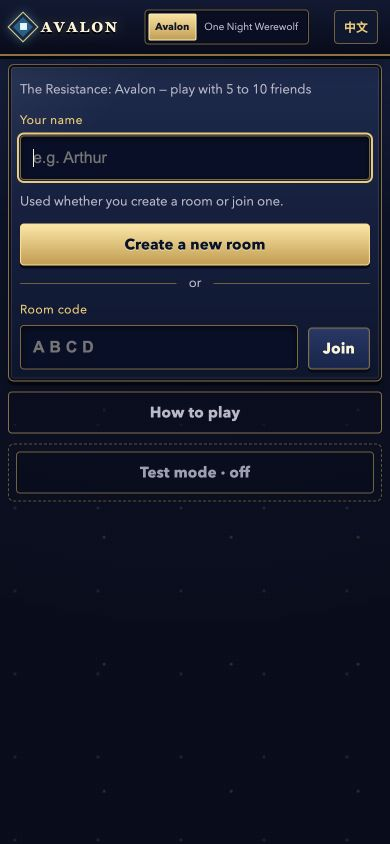
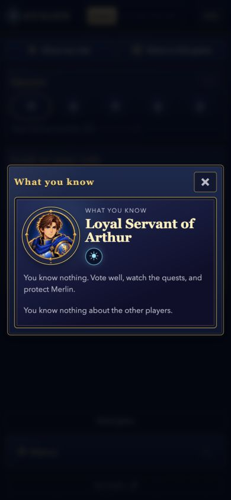
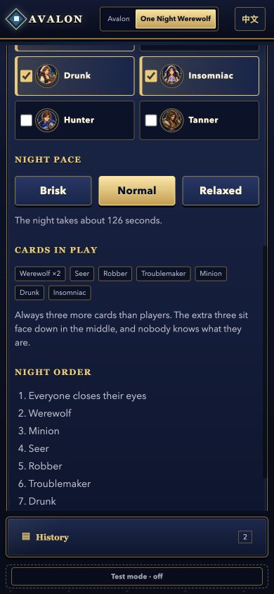

# Avalon

Play **The Resistance: Avalon** or **One Night Ultimate Werewolf** in a web
browser. One player creates a room, everyone joins from their phone, and each
player sees only the information meant for them.

- 3–10 players for One Night Ultimate Werewolf
- 5–10 players for Avalon
- English and Chinese on the same table
- No app install or account required

## Screenshots

<table>
  <tr>
    <th>Pick a game</th>
    <th>Discover your Avalon role</th>
    <th>Set up a werewolf night</th>
  </tr>
  <tr>
    <td></td>
    <td></td>
    <td></td>
  </tr>
</table>

## Play now

Open the [public Avalon client](https://shengjiex98.github.io/avalon/), enter
your name, and create a room. Share the four-letter room code with the other
players.

The public client connects to the default game server automatically. You do
not need to install Node.js, run a server, or host anything yourself.

## Optional: self-host

Self-hosting is optional. If you prefer to run your own game server, install
[Node.js 20 or newer](https://nodejs.org/) and run:

```bash
git clone https://github.com/shengjiex98/avalon.git
cd avalon
npm start
```

No database or build step is required.

Open [http://localhost:8420](http://localhost:8420) on the host computer and
create a room. Players on the same network open
`http://<host-computer-ip>:8420` on their device and enter the four-letter room
code.

To play with people outside your network, follow the
[remote hosting guide](docs/deployment.md).

## Pick a game

Use the switcher at the top of the page before starting:

- **Avalon:** propose teams, vote, complete quests, and find Merlin before the
  Assassin does.
- **One Night Ultimate Werewolf:** follow a timed narrated night, discuss what
  happened, and vote.

The host can change games while everyone is in the lobby. Each player can also
choose English or Chinese independently.

## Try it by yourself

Create a room, then turn on **test mode** at the bottom of the page. You can add
players and switch between their seats from one browser.

## Documentation

- [Game guide](docs/games.md)
- [Deployment](docs/deployment.md)
- [Developer documentation](docs/README.md)

Run the test suite with:

```bash
npm test
```
